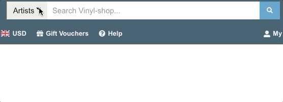
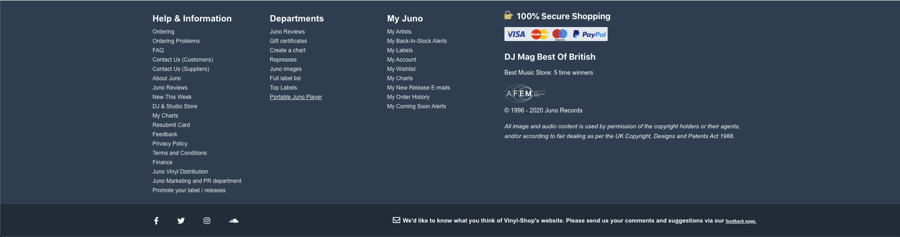
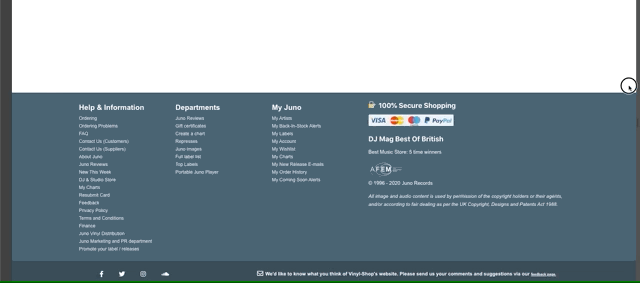

# Juno Records (WIP)

## Motivation

This is a tribute for one of my favorite online record stores, [Juno Records](http://www.juno.co.uk).

I decided to challenge myself to reverse engineer their website with Next.js and without using 3rd party design libraries, only my CSS-styled-components skills.

## Running the project

1. Clone the project.
2. Run ```yarn```.
3. Run ```yarn dev```.
4. Navigate to ```http://localhost:3000```.

## Building the project

1. Run ```yarn build```.
2. Run ```yarn start```.
3. Navigate to ```http://localhost:3000```;

## Screenshots

### Header


#### Responsive View


### Search + Dropdown



### Footer



#### Responsive View



### Vertical Tabs

